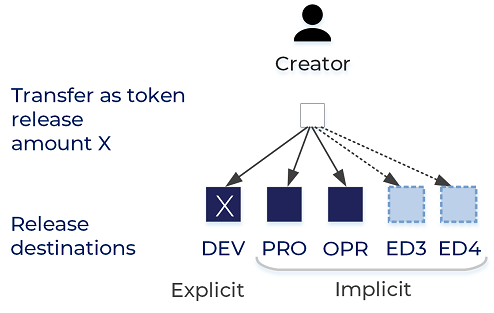
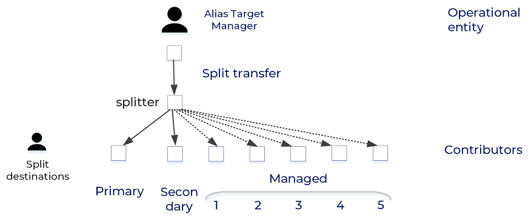
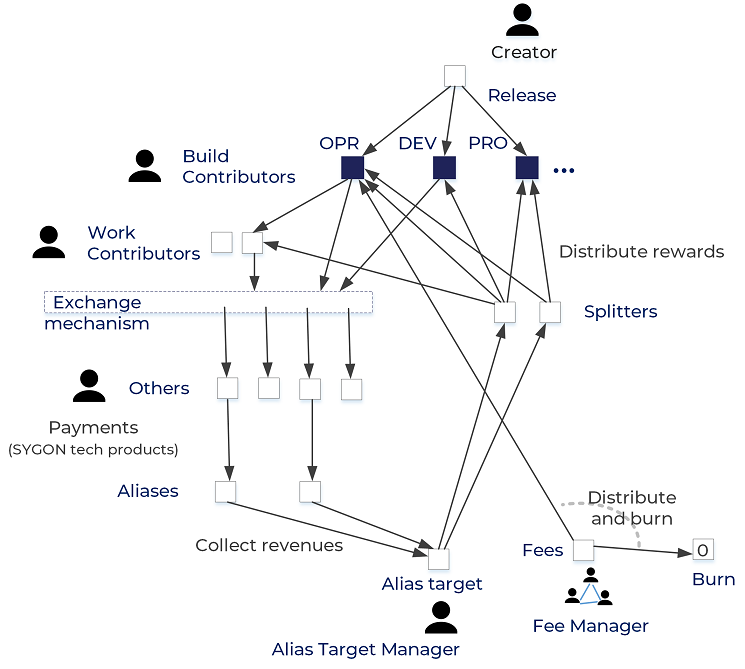

# SYGON token

  <table style="padding:5px;">
    <tr>
      <td>
        <b><h4>Name</h4></b>
      </td>
      <td>
        SYGON
      </td>
    </tr>
    <tr>
      <td>
        <b><h4>Symbol</h4></b>
      </td>
      <td>
        SYGON
      </td>
    </tr>
    <tr>
      <td>
        <b><h4>Type</h4></b>
      </td>
      <td>
        ERC20
      </td>
    </tr>
    <tr>
      <td>
        <b><h4>Decimals</h4></b>
      </td>
      <td>
        18
      </td>
    </tr>
    <tr>
      <td>
        <b><h4>Total Initial Supply (TIS)</h4></b>
      </td>
      <td>
         Fixed, 7500000000. This is the maximum amount that can be released ever.
      </td>
    </tr>
    <tr>
      <td>
        <b><h4>Total Released Quantity (TRQ)</h4></b>
      </td>
      <td>
        Total amount ever released from TIS.
      </td>
    </tr>
    <tr>
      <td>
        <b><h4>Total Maximum Burnable Quantity (TMBQ)</h4></b>
      </td>
      <td>
        Fixed, 6750000000 (representing 90% of the total initial supply).
      </td>
    </tr>
    <tr>
      <td>
        <b><h4>Total Burned Quantity (TBQ)</h4></b>
      </td>
      <td>
        Total amount of tokens burned so far. Burn applies to TRQ only.
      </td>
    </tr>
    <tr>
      <td>
        <b><h4>Total Circulating Supply (TCS)</h4></b>
      </td>
      <td>
        Total token supply that was released and was not burned yet. TCS=TRQ-TBQ
      </td>
    </tr>
    <tr>
      <td>
        <b><h4>Total Remaining Supply to be Released (TRSR)</h4></b>
      </td>
      <td>
        Total remaining token supply that can still be distributed from initial supply. TRSR=TIS-TRQ
      </td>
    </tr>
  </table>

The SYGON token implements the business model adopted by SynergyCrowds, with specific mechanisms for monetizing the contribution of sygons to producing knowledge in a decentralzied fashion.

  <b>Actors</b>  
There are five types of actor that interact with the SYGON token:
  <ol>
    <li>
      <b>Creator</b> releases SYGON tokens (with a dedicated method) to the <i>Build Contributors</i> for their contribution to developing the SYGON technology.
    </li>
    <li>
      <b>Build Contributor</b> directly contributes to the development of the SYGON technology generally by working on different tasks of specific development projects. This role assimilates the <b>build</b> contribution type described in <a href="https://medium.com/synergycrowds/sygon-token-5324be713c08"><i>The Sygon token</i></a> article, <b>Utility design</b> section.
    </li>
    <li>
      <b>Alias Target Manager</b> manages the target address of aliases and owns <i>addrAliasTarget</i>.
    </li>
    <li>
      <b>Fee Manager</b> manages the settings of the fee mechanism and the address collects fees applied to token transfers. The Fee Manager is a role played by a decentralized mechanism that allows all sygons to decide on the fee policy based on algorithmic meritocracy. The Fee Manager owns <i>addrFees</i>.
    </li>
    <li>
      <b>Other</b> is played by any other users, holding and transferring tokens for any purpose.
    </li>
  </ol>

 
<h1>Features</h1>

The SYGON token is: fungible, fractionable and burnable.

<h2>1 Transfers</h2>

<h3>1.1 <i>transfer</i> and <i>transferFrom</i></h3>

  As of ERC20, methods are used by any human or machine users to transfer SYGON tokens. 
  The function checks if the the amount is transferred to an <b>alias</b> or a <b>splitter</b>, performing the transfer accordingly.
  
  <b>Aliases</b> 
  Aliases are Ethereum addresses that receive a special treatment in relationship with the SYGON token. Any amount transferred to an alias address is forwarded automatically to a unique address (defined by <i>addrAliasTarget</i>).   
  More specifically, aliases are created by the operational entity (SynergyCrowds company) for all users of the SYGON technology products. The concept of alias can be found under the name of <i>Feed address</i> in the SynergyCrowds platform. This is a unique address that is allocated to every account after successfully upgrading to Level 2.

  <h3>1.2 <i>transferAsTokenRelease</i></h3>
  

The SYGON tokens are put into circulation with this method, exclusively by the Creator. This special method of transfer is meant to  release amounts of SYGON tokens directly to Build Contributors. So the token release is fully covered in contribution. The token is never initially released for investment or speculation purposes (with approaches like ICO / IEO) but only to reward real contributions to building the SYGON technology and its products.
  
INPUT 
  <ul>
    <li>
      <b>Beneficiary</b> 
      The address of the contributor to receive the Amount. 
    </li>
    <li>
      <b>Amount</b> 
      The amount of SYGON tokens being released from TRSR as reward for the delivered and validated contribution. 
    </li>
    <li>
      <b>Project ID</b> 
      The identifier of the project being developed within the SYGON technology/ product. 
    </li>
    <li>
      <b>Installment ID</b> 
      The installment ID of the current transfer for a particular Project ID. This is to provide transparency, by allowing anyone to track release transfers according to several milestones, along a roadmap of a project. For example, if the project targets the development of a software component, this approach matches with software development lifecycle, meaning that the contribution is rewarded gradually, for consecutive releases of the developed software. 
    </li>
  </ul>
  <h4>Release Destinations</h4>
  
   There are five release destinations from which three are explicitly defined: [0] DEV (Project Development), [1] PRO (Promotion), [2] OPR (Operational). While DEV destination is explicit, the rest of the destinations are implicit. This means that for a new release, the amount explicitely stated defaultly targets the DEV destination. Consequently, amounts for PRO and OPR destinations are calculated automatically based on their weights in the current Release Structure and the amount transferred to DEV. 
   
     
   
   All destinations together define the <b>Release Structure</b> (RS). For example, a structure like   RS{0:20,1:30,2:50,3:0,4:0} means that when a transfer of 10000 SYGON tokens is performed to DEV, automatically a transfer of 15000 SYGONs to PRO and a transfer of 25000 SYGONs to OPR destinations respectively are performed by the function.
   
   Also, there are destinations [3] RD3 and [4] RD4, with an initial weight of 0 (zero) left for future implementations.
   
   <b>Changing Destinations</b> Only changing the address and weight of destinations [1-4] are possible and they are performed by the Creator.
   
   <b>Reading Destinations</b> Settings of any release destination can be accessed through a valid name ("DEV", "PRO", "OPR", "RD3", "RD4"). Settings are defined by: destination ID, address and weight.
   
   Currently the following release structure is used but this can be adjusted at any time in the future based on several factors like: opinions of contributors, market prices, operational costs etc.
   
  <table>
  <tr><td>ID</td><td>Name</td><td>Address</td><td>Weight</td></tr>
  <tr><td>0</td><td>DEV</td><td>Parameter for transfer as token release</td><td>100 (unmutable)</td></tr>
  <tr><td>1</td><td>PRO</td><td>At creation (mutable by Creator)</td><td>150 (mutable by Creator)</td></tr>
  <tr><td>2</td><td>OPR</td><td>At creation (mutable by Creator)</td><td>250 (mutable by Creator)</td></tr>
  <tr><td>3</td><td>RD3</td><td>0 (mutable by Creator)</td><td>0 (mutable by Creator)</td></tr>
  <tr><td>4</td><td>RD4</td><td>0 (mutable by Creator)</td><td>0 (mutable by Creator)</td></tr>
  </table>
  
  <h3>1.3 <i>transferSplit</i></h3>
  

    This is a special method of token transfer. The function is internal and it is called automatically, when 
    the target address of a transfer is detected to be a splitter.  
    For any address that is registered as splitter, this mechanism allows that any amount received as a transfer to it, is automatically "forwarded" to other addresses, according to a predefined split schema.  
  
  <b>Splitters</b> 
  A splitter associates an address with a split schema, which defines a set of transfer destinations with associated weights. This mechanism allows at least two contributors to receive rewards for their contributions.
  
  Splitters are designed for automatically distributing the monetization of products among their contributors. 
  
  Any amount of tokens sent to a splitter is automatically distributed among the destinations defined in the split schema.
  
    

  The contributor that creates the splitter is called <i>Primary</i> and the second one is called <i>Secondary</i> contributor. The secondary contributor can furhter configure the splitter by managing other 5 contributors at choice.

  Split schema 
  <table>
  <tr><td><b>Entry type</b></td><td>Primary</td><td>Secondary</td><td>Managed1</td><td>Managed2</td><td>Managed3</td><td>Managed4</td><td>Managed5</td></tr>
  <tr><td><b>Index</b></td><td>0</td><td>1</td><td>2</td><td>3</td><td>4</td><td>5</td><td>6</td></tr>
  </table>
    
  <b>Example</b> 
  If an application A generates a revenue of 100 tokens, then the contributors of the application A get rewarded through a splitter. The splitter is created by user U1, with a secondary user U2. U2 further adds U3 and U4 (at entries 2 and 3 respectively) in the splitter. Split weights (WSplit) are: WSplit(U1)=30, WSplit(U2)=45, WSplit(U3)=35, WSplit(U4)=20. Any amount of tokens transferred to their splitter will lead to transfers from <i>addrAliasTarget</i> to split destination addresses in the following amounts: U1=30, U2=31.5, U3=24.5 and U4=14.   
  In this way, the monetization of the knowledge produced and delivered by the SYGON technology is transparently distributed among contributors only. The SynergyCrowds company, as an operational entity of the products, has an absolutely equal position with any other contributors, in terms of receiving revenues.  
  Any address in a split schema can be changed with a new one, by its owner.  
  The operational entity can distribute revenues exclusively throught splitters, without any other possible option.  
  <b>Configuring a splitter</b>  
  The primary contributor can change any destination address and weight in the splitter. The secondary contributor can change the address and weight of the 5 managed destinations. 
  Restriction: successfully transferring to a splitter requires that its weights are configured correctly, namely the sum of the weights of the last 6 destinations must be 100.
  

  
  <h3>1.4 <i>transferFromAliasTarget</i></h3>
  

    This is a special method of token transfer ensuring that all amounts received at <i>addrAliasTarget</i> are transferred to splitters only. No other destination is possible. This mechanism guarantees to the contributors that the entire monetization of the delivered knowledge is distributed among them and this process is completely transparent. 
  Transfers from <i>addrAliasTarget</i> can be performed either directly or delegated.
  

<h2>2 Fractionable</h2>

    The SYGON token is fractionable. Having 18 decimals, the smallest transferrable amount is 0.000000000000000001 SYGON tokens.
  

<h2>3 Burn</h2>

SYGON tokens can be burned by any token holder, from own balance. Also, a fraction of the collected fees are periodicaly burned (see chapter 4 - Fees).

The burn operation can only be applied to the released quantity of SYGON tokens. 

The burn operation is limited to a maximum quantity (TMBQ). 

The burn operation is forbidden for the Creator, so that the total supply is not affectable by this operation.

<h2>4 Fees </h2>
  

  Fees are applied to all token transfers, except the initial token release transfers.
  

  

  Fees are calculated based on the amount of transferred tokens and a specific factor applied to the amount. 
  <table>
    <tr>
      <td><b>Amount interval</b></td><td><b>Fee</b></td>
    </tr>
    <tr>
      <td>(0,4000]</td><td>0.05%</td>
    </tr>
    <tr>
      <td>(4000,40000]</td><td>0.005%</td>
    </tr>
    <tr>
      <td> >40000</td><td>0.0005%</td>
    </tr>
    </table>
  

  

  Fees are collected at <i>addrFees</i> and they are periodically distributed - partially to the operator entity (the SynergyCrowds company) and partially burned. The collected fees can be distributed only by using the <i>distributeAndBurnFee</i> function.
  

  
The proportion of token burn from the collected fees is established through open vote by sygons and stored in <i>nBurnFromFeeQuota</i>. 
  

<h2>5 SYGON Token Economy</h2>

The overview of the SYGON token economy.
 

<h3>Roles and responsibilities</h3>
<table>
  <tr>
    <td><b>Actor</b></td> <td><b>Identifier</b></td> <td><b>Entity</b></td>
  </tr>
  <tr>
    <td>Creator</td> <td><i>addrCreator</i></td> <td>Co-founder, Mircea Moca</td>
  </tr>
  <tr>
    <td>Fee Manager</td> <td><i>addrFeeManager</i></td> <td>Software - decentralized mechanism controlled by all sygons</td>
  </tr>
  <tr>
    <td>Alias Target Manager</td> <td><i>addrAliasTarget</i></td> <td>Operational entity</td>
  </tr>
  <tr>
    <td>Other</td> <td></td> <td>Any user holding and transferring SYGON tokens</td>
  </tr>
</table>  

The Creator is interested in building the SYGON technology. For this, he releases SYGON tokens to contributors that  participate to building the technology through specific development projects.

The collected fees can be distributed only to two destinations: <b>burn</b> and the <b>operational entity</b>. The ratio between the two destinations is decided by all willing sygons through vote and algorithmic meritocracy. Hence, the Fee Manager is a software mechanism used by sygons to decide in a decentralized manner.

The Fee Manager is also responsible for changing the fee settings (see Chapter 4 Fees). The Fee Manager is owned by Creator at creation and the ownership is transferred to the decentralized mechanism after its implementation, using <i>changeFeesAddr</i> (see <a href="https://github.com/mocamircea/sygon-token/blob/master/testing/UC19%20Change%20Fee%20Manager.md">UC19 Change Fee Manager</a>).
  
The Alias Target Manager is owned by the operational entity, having the responsibility to distribute the entire monetization of the products to their contributors. The contributors to be rewarded are registered in splitters. The key aspect is that there is no other way to withdraw amounts from the realized monetization but only to contributors, through splitters. Regarding the distribution of the realized revenues, the operational entity plays an equal role to any builder contributor. There is no possible way for the operational entity to have revenues distributed to itself for any particular product, while the rest of its contributors to be not. This is ensured by <i>transferFromAliasTarget</i> (see <a href="https://github.com/mocamircea/sygon-token/blob/master/testing/UC8%20Transfer%20from%20alias%20target.md#transfer-from-alias-target" target="_blank">UC8 Transfer from alias target</a>). Two types of contribution are rewarded with this mechanism: <b>build</b> and <b>extend</b> (for details on types of contribution, see <a href="https://medium.com/synergycrowds/sygon-token-5324be713c08"><i>The Sygon token</i></a> article, <b>Utility design</b> section).

<table>
  <tr>
    <td><b>Account</b></td> <td><b>Identifier</b></td> <td><b>Owner</b></td>
  </tr>
  <tr>
    <td>OPR release destination</td> <td><i>expDestinations["OPR"].addr</i></td> <td>Operational entity</td>
  </tr>
  <tr>
    <td>PRO release destination</td> <td><i>expDestinations["PRO"].addr</i></td> <td>Operational entity</td>
  </tr>
  <tr>
    <td>RD3 release destination</td> <td><i>expDestinations["RD3"].addr</i></td> <td>Creator, initially not allocated</td>
  </tr>
  <tr>
    <td>RD4 release destination</td> <td><i>expDestinations["RD4"].addr</i></td> <td>Creator, initially not allocated</td>
  </tr>
</table>

The operational entity owns the OPR and PRO release destinations. While the first one is used to support the operational activities required by the products of the SYGON technology, the second one is allocated for promotional activities related to the respective products. The RD3 and RD4 destinations are desinged for future use. Once they are explicitly allocated, the related documentation will be provided in this repository, as for the others.
